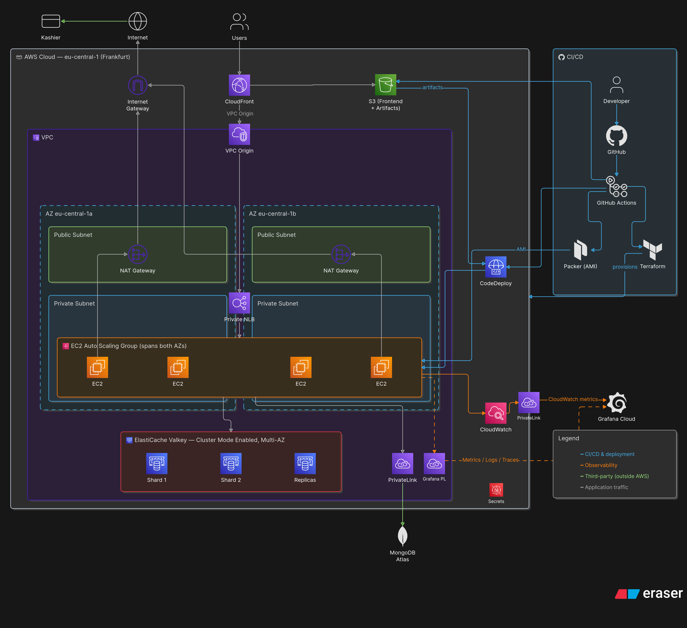
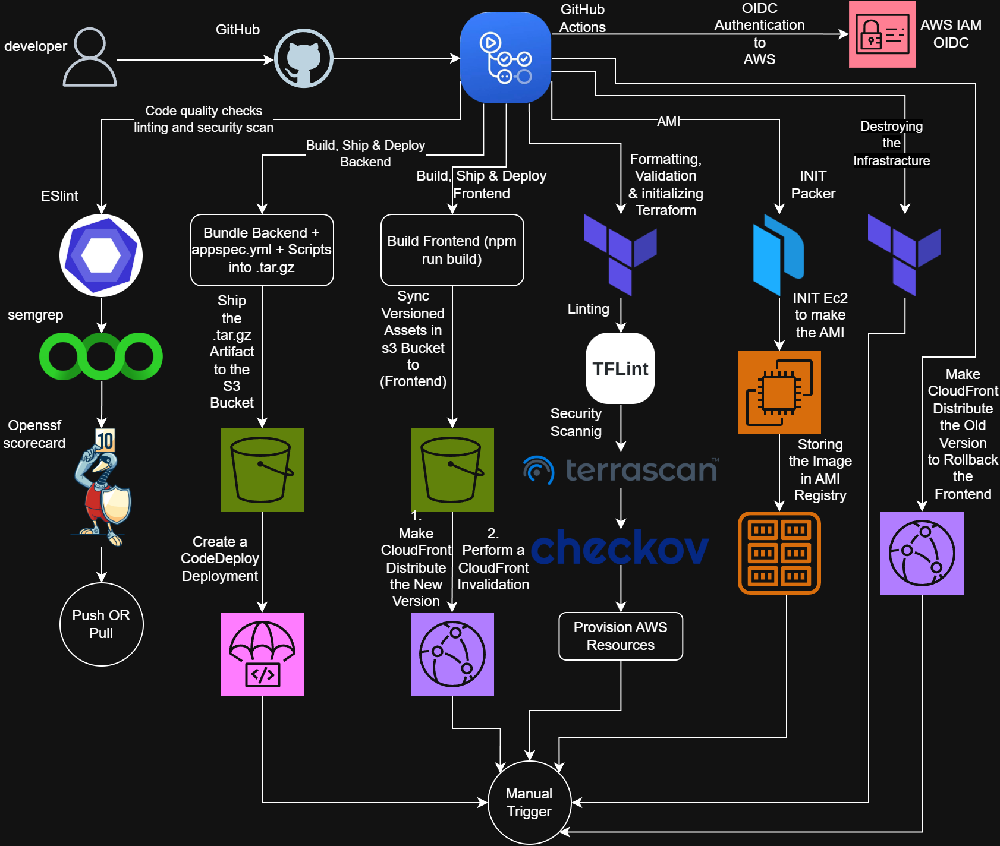

<h1 align="center">E-Commerce Store 🛒</h1>





[Video Tutorial on Youtube](https://youtu.be/sX57TLIPNx8)

About This Course:

-   🚀 Project Setup
-   🗄️ MongoDB & Redis Integration
-   💳 Stripe Payment Setup
-   🔐 Robust Authentication System
-   🔑 JWT with Refresh/Access Tokens
-   📝 User Signup & Login
-   🛒 E-Commerce Core
-   📦 Product & Category Management
-   🛍️ Shopping Cart Functionality
-   💰 Checkout with Stripe
-   🏷️ Coupon Code System
-   👑 Admin Dashboard
-   📊 Sales Analytics
-   🎨 Design with Tailwind
-   🛒 Cart & Checkout Process
-   🔒 Security
-   🛡️ Data Protection
-   🚀Caching with Redis
-   ⌛ And a lot more...

### Setup .env file

```bash
PORT=5000
MONGO_URI=your_mongo_uri

REDIS_HOST=app-valkey.xxxx.cache.amazonaws.com
REDIS_PORT=6379
REDIS_PASSWORD=your-auth-token
REDIS_TLS=true
REDIS_MODE=cluster

ACCESS_TOKEN_SECRET=your_access_token_secret
REFRESH_TOKEN_SECRET=your_refresh_token_secret

STRIPE_SECRET_KEY=your_stripe_secret_key
CLIENT_URL=http://localhost:5173
NODE_ENV=development

VITE_API_URL=the-nlb-dns

AWS_ACCESS_KEY_ID=your_access_key
AWS_SECRET_ACCESS_KEY=your_secret_key
AWS_REGION=us-east-1
S3_BUCKET_NAME=your_bucket_name

OTEL_EXPORTER_OTLP_ENDPOINT=http://your-collector:4318/v1/traces
OTEL_SERVICE_NAME=ecommerce-backend
```

### Run this app locally

```shell
npm run build
```

### Start the app

```shell
npm run start
```

```
GitHub secrets
Secret	Value
S3_BUCKET_NAME	mern-dev-<account-id>-artifacts (the s3 module's names changed)
LIVE_FRONTEND_BUCKET_NAME	mern-dev-<account-id>-frontend
CODEDEPLOY_APP_NAME / CODEDEPLOY_GROUP_NAME	backend-app / backend-deployment-group
CLOUDFRONT_KVS_ARN (new)	terraform output kvs_arn
SITE_URL (new)	https://<your-cloudfront-domain> or your own domain
CLOUDFRONT_DISTRIBUTION_ID, CLOUDFRONT_S3_ORIGIN_ID	delete, nothing uses them now
TF_API_TOKEN	delete, the S3 backend doesn't use it
```
